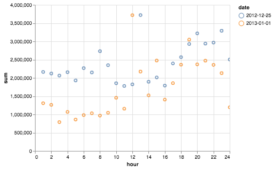

```{r, echo=FALSE}
library(ggplot2)
library(ggthemes)
library(plotly)
```

```{r,echo=FALSE}

household_5_p<- household_5 %>%
  ggplot(aes(hour, sum, color = as.factor(date))) +
  geom_line() +
  labs(title ="Total Energy Consumption by Household No.5", x = "Hour of the Day", y = "Smart Meters Value", caption = "Data Source: the Electricity Consumption and Occupancy data") +
  scale_color_manual(values = c("red","lightblue"), labels= c("Christmas Day","New Year"), name = "Occasion") +
  theme_clean() 

ggplotly(household_5_p)

```

####  $\color{blue}{\text{Design Rationale}}$: A line chart is helpful to visualize the energy consumption by the hour. From the graph, we can see that this household's energy consumption is quite similar for Christmas and New Year. The peak hours include the hour after the new year as well as the nights of Chritsmas and New Year. We also see a small peak around the dinner time (6pm). 


```{r,echo=FALSE}


household_4_p<- household_4 %>%
  ggplot(aes(hour, sum, color = as.factor(date))) +
  geom_line() +
  labs(title ="Total Energy Consumption by Household No.4", x = "Hour of the Day", y = "Smart Meters Value", caption = "Data Source: the Electricity Consumption and Occupancy data") +
  scale_color_manual(values = c("red","lightblue"), labels= c("Christmas Day","New Year"), name = "Occasion") +
  theme_clean() 

ggplotly(household_4_p)

```

####  $\color{blue}{\text{Design Rationale}}$: The energy consumption for this household is quite different. Both peaked during lunch hours (noon or 1pm). However, the level of energy consumption is significantly lower for New Year than Christmas. It could be that some members of the households were travelling for the New Year or more activities were happening during the Christmas Day. 

#### R software kept shutting down when loading the "Altair Package". Therefore, Below is the Altair graphic procuded via Python. 


```{r pressure, echo=FALSE, fig.cap ="Energy Consumption for Household No.4", out.width='30%'}

```


